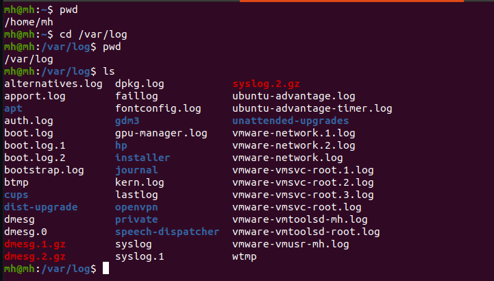

<!-- Banner Section -->

<!-- List of Content -->
## __List OF Content__
---
### 01. File System Navigation   
    
<!-- Sub content of File system navigation -->
   - ### List of content of the Home directory ( [VIEW](#List-of-content-of-the-Home-directory) )

   - ### Change Directory ( [VIEW](#Change-directory) )   

   - ### Find Bash Executable ( [VIEW](#Find-Bash-Executable) ) 

   - ### Find Current SHELL ( [VIEW](#Find-Current-SHELL) )

 

 <!-- Sub content of File system navigation -->
### __List of content of the Home directory__

Command: ls and ls -a | Type ls then we can see list of content in Home directory and type ls -a then show all of hidden content as well 

    cd ~ | pwd | ls | ls -a 
   

### __Change Directory__

Command: pwd, cd /var/log | Check current directory and got var/log directory and list of content

     pwd | cd /var/log | ls

### __Find Bash Executable__

Command: pwd, which bash | check display the path of bash executable using "which"

     pwd | which bash
    
   

### __Find Current SHELL__

Command: echo $SHELL | This command show which SHELL currently running

Command: echo $0 | Another way to find SHELL | This command two types of result 1. is (bash)-> It means Current SHELL, are not login SHELL and 2. is (-bash)-> It means current SHELL, are login SHELL

  

